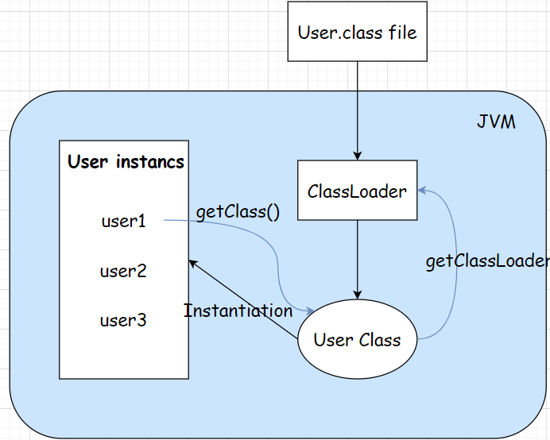

# IOC设计原理

IOC，简称控制反转，即转移控制权：你的控制权 -> IOC容器

## IOC的使用过程
1. IOC容器管理外部资源（组件）
2. 应用程序对象请求外部资源
3. IOC将外部资源注入到需要该资源的应用程序对象

参考Spring IOC的使用设计
```java
// App表示你的应用程序对象
public class App {

    // IOC 注入需要的AService类型的资源
    @Autowired
    private AService aService ;
}

// AService表示IOC托管的外部资源
@Service("AService")
public class AService {
}
```

## IOC容器的作用
- 管理对象：保存，删除，获取对象
- 支持注解注入

## IOC的实现
IOC的实现本质上是利用了Java类加载机制和反射机制。

### 类加载机制
Class文件由类装载器装载后，在JVM中形成一份描述Class结构的元信息对象，通过该元信息对象可以获知Class的结构信息：如构造函数、属性和方法等。
换言之，可以通过Java反射机制获取JVM中类的运行时描述信息。

```java
// AppClassLoader
ClassLoader loader = Thread.currentThread().getContextClassLoader();
Class<?>    clazz  = loader.loadClass("io.github.wdpm.ioc.model.User");

// get non-args constructor
Constructor<?> cons = clazz.getDeclaredConstructor((Class[]) null);
User           user = (User) cons.newInstance();

Method setName = clazz.getMethod("setName", String.class);
setName.invoke(user, "abc");

user.printName();
```


每一个类在JVM中都拥有一个对应的java.lang.Class对象。Class对象是由JVM通过调用类装载器中的defineClass()方法自动构造的。

### 反射机制
- Constructor：类的构造函数反射类，通过Class#getConstructors()方法可以获得类的所有构造函数反射对象数组Constructor<?>[]。
- Method：类方法的反射类，通过Class#getDeclaredMethods()方法可以获取类的所有方法反射对象数组Method[]。
- Field：类的成员变量的反射类，通过Class#getDeclaredFields()方法可以获取类的成员变量反射对象数组Field[]
  - 通过Class#getDeclaredField(String name)可获取某个特定名称的成员变量反射对象。
  - Field类最主要的方法是set(Object obj, Object value)，obj表示操作的目标对象，通过value为目标对象的成员变量设置值。
  如果成员变量为基础类型，可以使用Field类中提供的带类型名的值设置方法，如setBoolean(Object obj, boolean value)等。
  - 在访问private、protected成员变量和方法时必须通过setAccessible(boolean access)方法取消Java语言检查。

